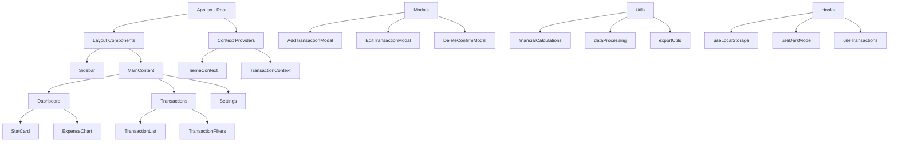
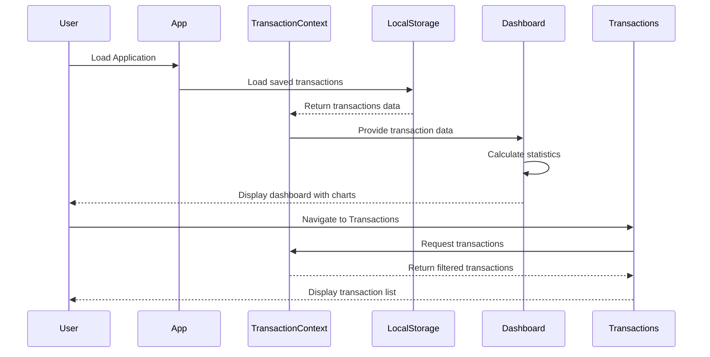
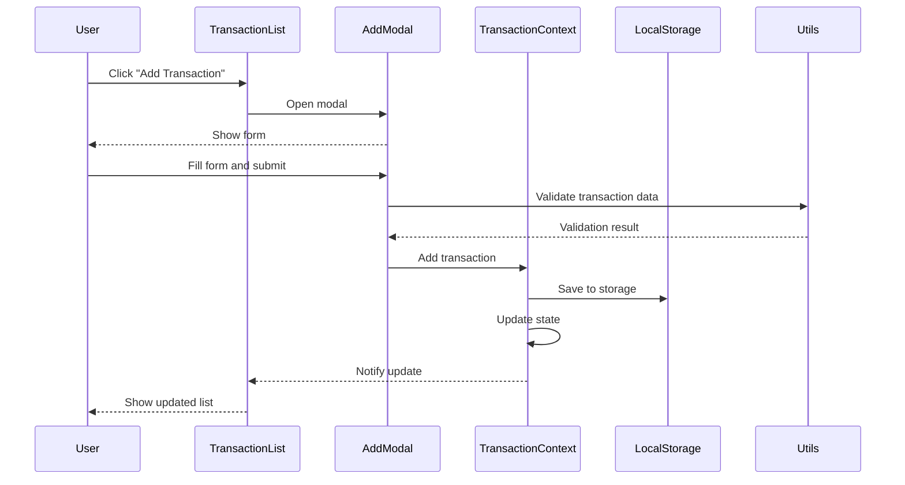
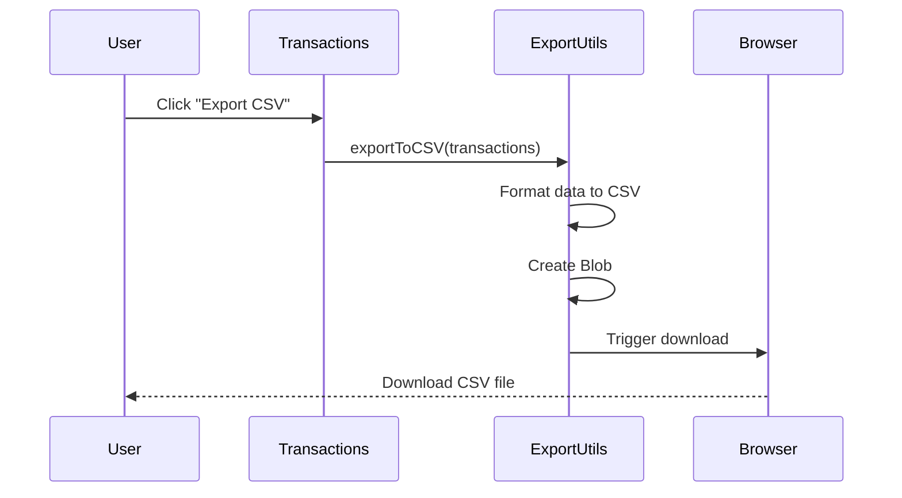

# Design Document: Expense Tracker Refactor

## Overview

The Hollow Expense Tracker refactoring transforms a monolithic React application from a single App.jsx file into a well-structured, maintainable codebase with proper separation of concerns. The refactored architecture organizes code into logical components (Sidebar, Dashboard, Transactions, Settings, Modals), utility modules for financial calculations and data processing, and custom hooks for shared logic. This design maintains all existing functionality including pie chart visualization, dark mode, CSV export, and print capabilities while improving code maintainability, testability, and developer experience.

## Architecture

The refactored application follows a component-based architecture with clear separation between UI components, business logic, and data management.



## Folder Structure


```
src/
├── components/
│   ├── layout/
│   │   ├── Sidebar.jsx
│   │   ├── MainContent.jsx
│   │   └── Layout.jsx
│   ├── dashboard/
│   │   ├── Dashboard.jsx
│   │   ├── StatCard.jsx
│   │   └── ExpenseChart.jsx
│   ├── transactions/
│   │   ├── Transactions.jsx
│   │   ├── TransactionList.jsx
│   │   ├── TransactionItem.jsx
│   │   └── TransactionFilters.jsx
│   ├── settings/
│   │   └── Settings.jsx
│   └── modals/
│       ├── AddTransactionModal.jsx
│       ├── EditTransactionModal.jsx
│       └── DeleteConfirmModal.jsx
├── context/
│   ├── ThemeContext.jsx
│   └── TransactionContext.jsx
├── hooks/
│   ├── useLocalStorage.js
│   ├── useDarkMode.js
│   └── useTransactions.js
├── utils/
│   ├── financialCalculations.js
│   ├── dataProcessing.js
│   └── exportUtils.js
├── constants/
│   └── categories.js
├── App.jsx
├── App.css
├── index.css
└── main.jsx
```

## Sequence Diagrams

### Main Application Flow



### Add Transaction Flow




### CSV Export Flow



## Components and Interfaces

### Component 1: App (Root Component)

**Purpose**: Root component that orchestrates the application, provides context providers, and manages routing between views.

**Interface**:
```typescript
interface AppProps {}

interface AppState {
  currentView: 'dashboard' | 'transactions' | 'settings'
}

function App(): JSX.Element
```

**Responsibilities**:
- Initialize context providers (Theme, Transactions)
- Manage view navigation state
- Render layout structure
- Coordinate global state

**Props**: None (root component)

**State**:
- `currentView`: Current active view/page

### Component 2: Sidebar

**Purpose**: Navigation sidebar with menu items and theme toggle.

**Interface**:
```typescript
interface SidebarProps {
  currentView: 'dashboard' | 'transactions' | 'settings'
  onNavigate: (view: string) => void
  darkMode: boolean
  onToggleDarkMode: () => void
}

function Sidebar(props: SidebarProps): JSX.Element
```

**Responsibilities**:
- Display navigation menu items
- Highlight active view
- Provide dark mode toggle
- Handle navigation clicks

**Props**:
- `currentView`: Currently active view for highlighting
- `onNavigate`: Callback when user clicks navigation item
- `darkMode`: Current dark mode state
- `onToggleDarkMode`: Callback to toggle dark mode


### Component 3: Dashboard

**Purpose**: Main dashboard view displaying financial statistics and expense chart.

**Interface**:
```typescript
interface DashboardProps {
  transactions: Transaction[]
}

function Dashboard(props: DashboardProps): JSX.Element
```

**Responsibilities**:
- Calculate and display total income, expenses, and balance
- Render StatCard components for each metric
- Display ExpenseChart with category breakdown
- Update statistics when transactions change

**Props**:
- `transactions`: Array of all transactions for calculations

**Internal State**: None (uses derived calculations)

### Component 4: StatCard

**Purpose**: Reusable card component for displaying financial statistics.

**Interface**:
```typescript
interface StatCardProps {
  title: string
  amount: number
  icon: string
  color: 'green' | 'red' | 'blue'
  trend?: {
    value: number
    direction: 'up' | 'down'
  }
}

function StatCard(props: StatCardProps): JSX.Element
```

**Responsibilities**:
- Display formatted currency amount
- Show icon and title
- Apply color styling based on type
- Optionally display trend indicator

**Props**:
- `title`: Card title (e.g., "Total Income")
- `amount`: Numeric amount to display
- `icon`: Icon identifier or emoji
- `color`: Color theme for the card
- `trend`: Optional trend data with percentage and direction

### Component 5: ExpenseChart

**Purpose**: Pie chart visualization of expenses by category.

**Interface**:
```typescript
interface ExpenseChartProps {
  transactions: Transaction[]
  chartType?: 'pie' | 'donut'
}

function ExpenseChart(props: ExpenseChartProps): JSX.Element
```

**Responsibilities**:
- Filter expense transactions
- Group expenses by category
- Calculate category totals and percentages
- Render pie/donut chart visualization
- Display legend with category colors

**Props**:
- `transactions`: Array of transactions to visualize
- `chartType`: Type of chart to render (default: 'pie')

**Internal State**:
- `chartData`: Processed data for chart rendering


### Component 6: Transactions

**Purpose**: Main transactions view with list, filters, and action buttons.

**Interface**:
```typescript
interface TransactionsProps {
  transactions: Transaction[]
  onAddTransaction: (transaction: Transaction) => void
  onEditTransaction: (id: string, transaction: Transaction) => void
  onDeleteTransaction: (id: string) => void
}

function Transactions(props: TransactionsProps): JSX.Element
```

**Responsibilities**:
- Display transaction list with filters
- Provide add/edit/delete actions
- Handle CSV export
- Handle print functionality
- Manage modal states

**Props**:
- `transactions`: Array of all transactions
- `onAddTransaction`: Callback to add new transaction
- `onEditTransaction`: Callback to edit existing transaction
- `onDeleteTransaction`: Callback to delete transaction

**Internal State**:
- `filters`: Current filter settings (date range, category, type)
- `showAddModal`: Boolean for add modal visibility
- `editingTransaction`: Transaction being edited (or null)
- `deletingTransactionId`: ID of transaction to delete (or null)

### Component 7: TransactionList

**Purpose**: Displays filtered list of transactions.

**Interface**:
```typescript
interface TransactionListProps {
  transactions: Transaction[]
  onEdit: (transaction: Transaction) => void
  onDelete: (id: string) => void
}

function TransactionList(props: TransactionListProps): JSX.Element
```

**Responsibilities**:
- Render list of TransactionItem components
- Handle empty state
- Provide edit/delete actions to parent

**Props**:
- `transactions`: Filtered array of transactions to display
- `onEdit`: Callback when edit button clicked
- `onDelete`: Callback when delete button clicked

### Component 8: TransactionItem

**Purpose**: Individual transaction row with details and actions.

**Interface**:
```typescript
interface TransactionItemProps {
  transaction: Transaction
  onEdit: () => void
  onDelete: () => void
}

function TransactionItem(props: TransactionItemProps): JSX.Element
```

**Responsibilities**:
- Display transaction details (date, description, category, amount)
- Show appropriate styling for income/expense
- Provide edit and delete buttons

**Props**:
- `transaction`: Transaction data to display
- `onEdit`: Callback when edit clicked
- `onDelete`: Callback when delete clicked


### Component 9: TransactionFilters

**Purpose**: Filter controls for transactions (date range, category, type).

**Interface**:
```typescript
interface FilterState {
  dateRange: {
    start: string | null
    end: string | null
  }
  category: string | null
  type: 'all' | 'income' | 'expense'
}

interface TransactionFiltersProps {
  filters: FilterState
  onFilterChange: (filters: FilterState) => void
  categories: string[]
}

function TransactionFilters(props: TransactionFiltersProps): JSX.Element
```

**Responsibilities**:
- Render filter input controls
- Handle filter value changes
- Provide reset filters functionality

**Props**:
- `filters`: Current filter state
- `onFilterChange`: Callback when filters change
- `categories`: Available categories for dropdown

### Component 10: Settings

**Purpose**: Application settings view (theme, categories, preferences).

**Interface**:
```typescript
interface SettingsProps {
  darkMode: boolean
  onToggleDarkMode: () => void
  categories: string[]
  onUpdateCategories: (categories: string[]) => void
}

function Settings(props: SettingsProps): JSX.Element
```

**Responsibilities**:
- Display theme settings
- Manage custom categories
- Handle app preferences
- Provide data management options (clear all, import/export)

**Props**:
- `darkMode`: Current dark mode state
- `onToggleDarkMode`: Callback to toggle dark mode
- `categories`: Current category list
- `onUpdateCategories`: Callback to update categories

### Component 11: AddTransactionModal

**Purpose**: Modal dialog for adding new transactions.

**Interface**:
```typescript
interface AddTransactionModalProps {
  isOpen: boolean
  onClose: () => void
  onSubmit: (transaction: Omit<Transaction, 'id'>) => void
  categories: string[]
}

function AddTransactionModal(props: AddTransactionModalProps): JSX.Element
```

**Responsibilities**:
- Display transaction form
- Validate form inputs
- Handle form submission
- Reset form on close

**Props**:
- `isOpen`: Modal visibility state
- `onClose`: Callback to close modal
- `onSubmit`: Callback with new transaction data
- `categories`: Available categories for dropdown

**Internal State**:
- `formData`: Form field values
- `errors`: Validation error messages


### Component 12: EditTransactionModal

**Purpose**: Modal dialog for editing existing transactions.

**Interface**:
```typescript
interface EditTransactionModalProps {
  isOpen: boolean
  transaction: Transaction | null
  onClose: () => void
  onSubmit: (id: string, transaction: Omit<Transaction, 'id'>) => void
  categories: string[]
}

function EditTransactionModal(props: EditTransactionModalProps): JSX.Element
```

**Responsibilities**:
- Pre-populate form with existing transaction data
- Validate form inputs
- Handle form submission
- Reset form on close

**Props**:
- `isOpen`: Modal visibility state
- `transaction`: Transaction being edited
- `onClose`: Callback to close modal
- `onSubmit`: Callback with updated transaction data
- `categories`: Available categories for dropdown

**Internal State**:
- `formData`: Form field values
- `errors`: Validation error messages

### Component 13: DeleteConfirmModal

**Purpose**: Confirmation dialog for deleting transactions.

**Interface**:
```typescript
interface DeleteConfirmModalProps {
  isOpen: boolean
  transactionDescription: string
  onClose: () => void
  onConfirm: () => void
}

function DeleteConfirmModal(props: DeleteConfirmModalProps): JSX.Element
```

**Responsibilities**:
- Display confirmation message
- Show transaction details
- Handle confirm/cancel actions

**Props**:
- `isOpen`: Modal visibility state
- `transactionDescription`: Description of transaction to delete
- `onClose`: Callback to cancel deletion
- `onConfirm`: Callback to confirm deletion

## Data Models

### Model 1: Transaction

```typescript
interface Transaction {
  id: string
  date: string // ISO 8601 format (YYYY-MM-DD)
  description: string
  category: string
  amount: number
  type: 'income' | 'expense'
  createdAt: string // ISO 8601 timestamp
  updatedAt: string // ISO 8601 timestamp
}
```

**Validation Rules**:
- `id`: Must be unique UUID
- `date`: Must be valid ISO date string
- `description`: Non-empty string, max 200 characters
- `category`: Must be from predefined categories list
- `amount`: Positive number, max 2 decimal places
- `type`: Must be either 'income' or 'expense'
- `createdAt`: Auto-generated timestamp
- `updatedAt`: Auto-updated on edit


### Model 2: FilterState

```typescript
interface FilterState {
  dateRange: {
    start: string | null // ISO date or null
    end: string | null // ISO date or null
  }
  category: string | null // Category name or null for all
  type: 'all' | 'income' | 'expense'
  searchTerm?: string // Optional text search
}
```

**Validation Rules**:
- `dateRange.start`: Must be valid date or null
- `dateRange.end`: Must be valid date or null, must be >= start if both set
- `category`: Must be valid category or null
- `type`: Must be one of the three allowed values
- `searchTerm`: Optional string for text filtering

### Model 3: ChartData

```typescript
interface ChartDataPoint {
  category: string
  amount: number
  percentage: number
  color: string
}

interface ChartData {
  dataPoints: ChartDataPoint[]
  total: number
}
```

**Validation Rules**:
- `category`: Non-empty string
- `amount`: Non-negative number
- `percentage`: Number between 0 and 100
- `color`: Valid CSS color string
- `total`: Sum of all amounts

### Model 4: AppSettings

```typescript
interface AppSettings {
  darkMode: boolean
  currency: string
  dateFormat: string
  categories: string[]
  defaultView: 'dashboard' | 'transactions' | 'settings'
}
```

**Validation Rules**:
- `darkMode`: Boolean value
- `currency`: Valid currency code (e.g., 'USD', 'EUR')
- `dateFormat`: Valid date format string
- `categories`: Non-empty array of unique strings
- `defaultView`: Must be one of the three allowed views

## Context Providers

### Context 1: ThemeContext

**Purpose**: Manages dark mode state across the application.

**Interface**:
```typescript
interface ThemeContextValue {
  darkMode: boolean
  toggleDarkMode: () => void
}

const ThemeContext = createContext<ThemeContextValue | undefined>(undefined)

function ThemeProvider({ children }: { children: ReactNode }): JSX.Element

function useTheme(): ThemeContextValue
```

**Responsibilities**:
- Maintain dark mode state
- Persist theme preference to localStorage
- Apply theme class to document root
- Provide theme toggle function


### Context 2: TransactionContext

**Purpose**: Manages transaction data and operations across the application.

**Interface**:
```typescript
interface TransactionContextValue {
  transactions: Transaction[]
  addTransaction: (transaction: Omit<Transaction, 'id' | 'createdAt' | 'updatedAt'>) => void
  updateTransaction: (id: string, transaction: Partial<Transaction>) => void
  deleteTransaction: (id: string) => void
  getTransactionById: (id: string) => Transaction | undefined
  filterTransactions: (filters: FilterState) => Transaction[]
  categories: string[]
  updateCategories: (categories: string[]) => void
}

const TransactionContext = createContext<TransactionContextValue | undefined>(undefined)

function TransactionProvider({ children }: { children: ReactNode }): JSX.Element

function useTransactionContext(): TransactionContextValue
```

**Responsibilities**:
- Maintain transactions state
- Persist transactions to localStorage
- Provide CRUD operations for transactions
- Manage categories list
- Provide filtering functionality

## Custom Hooks

### Hook 1: useLocalStorage

**Purpose**: Generic hook for syncing state with localStorage.

**Interface**:
```typescript
function useLocalStorage<T>(
  key: string,
  initialValue: T
): [T, (value: T | ((prev: T) => T)) => void]
```

**Preconditions**:
- `key` is non-empty string
- `initialValue` is serializable to JSON

**Postconditions**:
- Returns current value and setter function
- Value is persisted to localStorage on change
- Value is loaded from localStorage on mount

**Parameters**:
- `key`: localStorage key name
- `initialValue`: Default value if key doesn't exist

**Returns**: Tuple of [value, setValue] similar to useState

### Hook 2: useDarkMode

**Purpose**: Manages dark mode state with localStorage persistence.

**Interface**:
```typescript
function useDarkMode(): [boolean, () => void]
```

**Preconditions**: None

**Postconditions**:
- Returns dark mode state and toggle function
- Dark mode preference persisted to localStorage
- Document root class updated on change

**Returns**: Tuple of [darkMode, toggleDarkMode]


### Hook 3: useTransactions

**Purpose**: Provides transaction operations and filtered data.

**Interface**:
```typescript
interface UseTransactionsOptions {
  filters?: FilterState
}

interface UseTransactionsReturn {
  transactions: Transaction[]
  filteredTransactions: Transaction[]
  addTransaction: (transaction: Omit<Transaction, 'id' | 'createdAt' | 'updatedAt'>) => void
  updateTransaction: (id: string, updates: Partial<Transaction>) => void
  deleteTransaction: (id: string) => void
  isLoading: boolean
}

function useTransactions(options?: UseTransactionsOptions): UseTransactionsReturn
```

**Preconditions**:
- TransactionContext must be available in component tree

**Postconditions**:
- Returns transaction data and operations
- Filtered transactions match provided filters
- Operations update context state

**Parameters**:
- `options`: Optional configuration with filters

**Returns**: Object with transactions and CRUD operations

## Utility Functions

### Module 1: financialCalculations.js

**Purpose**: Financial calculation utilities for statistics and aggregations.

**Functions**:

#### calculateTotalIncome

```typescript
function calculateTotalIncome(transactions: Transaction[]): number
```

**Preconditions**:
- `transactions` is valid array (may be empty)
- Each transaction has valid `type` and `amount`

**Postconditions**:
- Returns sum of all income transactions
- Returns 0 if no income transactions
- Result is non-negative number

**Parameters**:
- `transactions`: Array of transactions to process

**Returns**: Total income amount

#### calculateTotalExpenses

```typescript
function calculateTotalExpenses(transactions: Transaction[]): number
```

**Preconditions**:
- `transactions` is valid array (may be empty)
- Each transaction has valid `type` and `amount`

**Postconditions**:
- Returns sum of all expense transactions
- Returns 0 if no expense transactions
- Result is non-negative number

**Parameters**:
- `transactions`: Array of transactions to process

**Returns**: Total expenses amount

#### calculateBalance

```typescript
function calculateBalance(transactions: Transaction[]): number
```

**Preconditions**:
- `transactions` is valid array (may be empty)

**Postconditions**:
- Returns income minus expenses
- Result can be positive, negative, or zero

**Parameters**:
- `transactions`: Array of transactions to process

**Returns**: Net balance (income - expenses)


#### groupByCategory

```typescript
interface CategoryTotal {
  category: string
  total: number
  count: number
}

function groupByCategory(transactions: Transaction[]): CategoryTotal[]
```

**Preconditions**:
- `transactions` is valid array (may be empty)
- Each transaction has valid `category` and `amount`

**Postconditions**:
- Returns array of category totals
- Each category appears once
- Totals are accurate sums
- Array is sorted by total descending

**Parameters**:
- `transactions`: Array of transactions to group

**Returns**: Array of category totals with counts

#### calculateCategoryPercentages

```typescript
interface CategoryPercentage {
  category: string
  amount: number
  percentage: number
}

function calculateCategoryPercentages(transactions: Transaction[]): CategoryPercentage[]
```

**Preconditions**:
- `transactions` is valid array (may be empty)
- Each transaction has valid `category` and `amount`

**Postconditions**:
- Returns array with percentage for each category
- Percentages sum to 100 (or 0 if no transactions)
- Percentages rounded to 2 decimal places

**Parameters**:
- `transactions`: Array of transactions to analyze

**Returns**: Array of categories with percentages

### Module 2: dataProcessing.js

**Purpose**: Data filtering, sorting, and transformation utilities.

**Functions**:

#### filterTransactions

```typescript
function filterTransactions(
  transactions: Transaction[],
  filters: FilterState
): Transaction[]
```

**Preconditions**:
- `transactions` is valid array
- `filters` is valid FilterState object

**Postconditions**:
- Returns filtered subset of transactions
- Original array is not modified
- All returned transactions match filter criteria

**Parameters**:
- `transactions`: Array to filter
- `filters`: Filter criteria to apply

**Returns**: Filtered transaction array

**Algorithm**:
```typescript
ALGORITHM filterTransactions(transactions, filters)
INPUT: transactions (array), filters (FilterState)
OUTPUT: filtered (array)

BEGIN
  filtered ← transactions
  
  // Filter by type
  IF filters.type ≠ 'all' THEN
    filtered ← filtered.filter(t => t.type = filters.type)
  END IF
  
  // Filter by date range
  IF filters.dateRange.start ≠ null THEN
    filtered ← filtered.filter(t => t.date ≥ filters.dateRange.start)
  END IF
  
  IF filters.dateRange.end ≠ null THEN
    filtered ← filtered.filter(t => t.date ≤ filters.dateRange.end)
  END IF
  
  // Filter by category
  IF filters.category ≠ null THEN
    filtered ← filtered.filter(t => t.category = filters.category)
  END IF
  
  // Filter by search term
  IF filters.searchTerm ≠ null AND filters.searchTerm ≠ '' THEN
    searchLower ← filters.searchTerm.toLowerCase()
    filtered ← filtered.filter(t => 
      t.description.toLowerCase().includes(searchLower)
    )
  END IF
  
  RETURN filtered
END
```


#### sortTransactions

```typescript
type SortField = 'date' | 'amount' | 'description' | 'category'
type SortOrder = 'asc' | 'desc'

function sortTransactions(
  transactions: Transaction[],
  field: SortField,
  order: SortOrder
): Transaction[]
```

**Preconditions**:
- `transactions` is valid array
- `field` is valid sort field
- `order` is 'asc' or 'desc'

**Postconditions**:
- Returns sorted copy of transactions
- Original array is not modified
- Sort is stable (maintains relative order of equal elements)

**Parameters**:
- `transactions`: Array to sort
- `field`: Field to sort by
- `order`: Sort direction

**Returns**: Sorted transaction array

#### validateTransaction

```typescript
interface ValidationResult {
  isValid: boolean
  errors: Record<string, string>
}

function validateTransaction(
  transaction: Partial<Transaction>
): ValidationResult
```

**Preconditions**:
- `transaction` is object (may have missing fields)

**Postconditions**:
- Returns validation result with errors
- `isValid` is true if and only if no errors
- Each error has descriptive message

**Parameters**:
- `transaction`: Transaction data to validate

**Returns**: Validation result object

**Algorithm**:
```typescript
ALGORITHM validateTransaction(transaction)
INPUT: transaction (object)
OUTPUT: result (ValidationResult)

BEGIN
  errors ← {}
  
  // Validate date
  IF transaction.date = null OR transaction.date = '' THEN
    errors.date ← "Date is required"
  ELSE IF NOT isValidDate(transaction.date) THEN
    errors.date ← "Invalid date format"
  END IF
  
  // Validate description
  IF transaction.description = null OR transaction.description.trim() = '' THEN
    errors.description ← "Description is required"
  ELSE IF transaction.description.length > 200 THEN
    errors.description ← "Description must be 200 characters or less"
  END IF
  
  // Validate amount
  IF transaction.amount = null OR transaction.amount ≤ 0 THEN
    errors.amount ← "Amount must be greater than 0"
  ELSE IF NOT isValidDecimal(transaction.amount, 2) THEN
    errors.amount ← "Amount must have at most 2 decimal places"
  END IF
  
  // Validate category
  IF transaction.category = null OR transaction.category = '' THEN
    errors.category ← "Category is required"
  END IF
  
  // Validate type
  IF transaction.type ≠ 'income' AND transaction.type ≠ 'expense' THEN
    errors.type ← "Type must be 'income' or 'expense'"
  END IF
  
  isValid ← (Object.keys(errors).length = 0)
  
  RETURN { isValid, errors }
END
```


### Module 3: exportUtils.js

**Purpose**: Export and print functionality for transactions.

**Functions**:

#### exportToCSV

```typescript
function exportToCSV(
  transactions: Transaction[],
  filename?: string
): void
```

**Preconditions**:
- `transactions` is valid array (may be empty)
- `filename` is valid string or undefined

**Postconditions**:
- CSV file is downloaded to user's device
- File contains all transaction data
- Headers are included in first row
- No side effects on transactions array

**Parameters**:
- `transactions`: Array of transactions to export
- `filename`: Optional custom filename (default: 'transactions.csv')

**Returns**: void (triggers browser download)

**Algorithm**:
```typescript
ALGORITHM exportToCSV(transactions, filename)
INPUT: transactions (array), filename (string, optional)
OUTPUT: void (side effect: file download)

BEGIN
  // Set default filename
  IF filename = undefined THEN
    filename ← 'transactions_' + getCurrentDate() + '.csv'
  END IF
  
  // Create CSV header
  headers ← ['Date', 'Description', 'Category', 'Type', 'Amount']
  csvContent ← headers.join(',') + '\n'
  
  // Add transaction rows
  FOR each transaction IN transactions DO
    row ← [
      transaction.date,
      escapeCSV(transaction.description),
      transaction.category,
      transaction.type,
      transaction.amount.toFixed(2)
    ]
    csvContent ← csvContent + row.join(',') + '\n'
  END FOR
  
  // Create blob and download
  blob ← new Blob([csvContent], { type: 'text/csv' })
  url ← URL.createObjectURL(blob)
  
  link ← document.createElement('a')
  link.href ← url
  link.download ← filename
  link.click()
  
  URL.revokeObjectURL(url)
END
```

#### prepareForPrint

```typescript
function prepareForPrint(
  transactions: Transaction[],
  includeChart?: boolean
): void
```

**Preconditions**:
- `transactions` is valid array
- `includeChart` is boolean or undefined

**Postconditions**:
- Print dialog is opened
- Print-friendly styles are applied
- Original page state is restored after print

**Parameters**:
- `transactions`: Transactions to include in print
- `includeChart`: Whether to include chart visualization (default: true)

**Returns**: void (triggers browser print dialog)

#### formatCurrency

```typescript
function formatCurrency(
  amount: number,
  currency?: string
): string
```

**Preconditions**:
- `amount` is valid number
- `currency` is valid currency code or undefined

**Postconditions**:
- Returns formatted currency string
- Includes currency symbol
- Formatted with appropriate decimal places

**Parameters**:
- `amount`: Numeric amount to format
- `currency`: Currency code (default: 'USD')

**Returns**: Formatted currency string (e.g., "$1,234.56")


## Constants

### categories.js

**Purpose**: Define default expense and income categories.

```typescript
export const EXPENSE_CATEGORIES = [
  'Food & Dining',
  'Transportation',
  'Shopping',
  'Entertainment',
  'Bills & Utilities',
  'Healthcare',
  'Education',
  'Travel',
  'Personal Care',
  'Other'
]

export const INCOME_CATEGORIES = [
  'Salary',
  'Freelance',
  'Investment',
  'Gift',
  'Refund',
  'Other'
]

export const CATEGORY_COLORS = {
  'Food & Dining': '#FF6384',
  'Transportation': '#36A2EB',
  'Shopping': '#FFCE56',
  'Entertainment': '#4BC0C0',
  'Bills & Utilities': '#9966FF',
  'Healthcare': '#FF9F40',
  'Education': '#FF6384',
  'Travel': '#C9CBCF',
  'Personal Care': '#4BC0C0',
  'Salary': '#36A2EB',
  'Freelance': '#FFCE56',
  'Investment': '#4BC0C0',
  'Gift': '#FF6384',
  'Refund': '#9966FF',
  'Other': '#E7E9ED'
}

export const DEFAULT_CURRENCY = 'USD'

export const DATE_FORMAT = 'YYYY-MM-DD'
```

## Algorithmic Pseudocode

### Main Application Initialization

```typescript
ALGORITHM initializeApplication()
INPUT: none
OUTPUT: initialized application state

BEGIN
  // Load persisted data
  savedTransactions ← localStorage.getItem('transactions')
  savedTheme ← localStorage.getItem('darkMode')
  savedCategories ← localStorage.getItem('categories')
  
  // Initialize state with defaults or saved values
  IF savedTransactions ≠ null THEN
    transactions ← JSON.parse(savedTransactions)
  ELSE
    transactions ← []
  END IF
  
  IF savedTheme ≠ null THEN
    darkMode ← JSON.parse(savedTheme)
  ELSE
    darkMode ← false
  END IF
  
  IF savedCategories ≠ null THEN
    categories ← JSON.parse(savedCategories)
  ELSE
    categories ← [...EXPENSE_CATEGORIES, ...INCOME_CATEGORIES]
  END IF
  
  // Apply theme
  IF darkMode = true THEN
    document.documentElement.classList.add('dark')
  END IF
  
  RETURN { transactions, darkMode, categories }
END
```

**Preconditions**:
- localStorage is available
- Browser supports required APIs

**Postconditions**:
- Application state is initialized
- Persisted data is loaded if available
- Theme is applied to document


### Transaction CRUD Operations

#### Add Transaction Algorithm

```typescript
ALGORITHM addTransaction(transactionData)
INPUT: transactionData (object without id, createdAt, updatedAt)
OUTPUT: newTransaction (complete Transaction object)

BEGIN
  // Validate input
  validationResult ← validateTransaction(transactionData)
  IF validationResult.isValid = false THEN
    THROW ValidationError(validationResult.errors)
  END IF
  
  // Generate new transaction
  newTransaction ← {
    id: generateUUID(),
    ...transactionData,
    createdAt: getCurrentTimestamp(),
    updatedAt: getCurrentTimestamp()
  }
  
  // Update state
  transactions ← [...transactions, newTransaction]
  
  // Persist to storage
  localStorage.setItem('transactions', JSON.stringify(transactions))
  
  RETURN newTransaction
END
```

**Preconditions**:
- `transactionData` contains required fields (date, description, category, amount, type)
- All field values are valid types

**Postconditions**:
- New transaction is added to state
- Transaction has unique ID and timestamps
- Data is persisted to localStorage
- Returns complete transaction object

**Loop Invariants**: N/A (no loops)

#### Update Transaction Algorithm

```typescript
ALGORITHM updateTransaction(id, updates)
INPUT: id (string), updates (partial Transaction object)
OUTPUT: updatedTransaction (complete Transaction object)

BEGIN
  // Find transaction
  index ← transactions.findIndex(t => t.id = id)
  IF index = -1 THEN
    THROW NotFoundError("Transaction not found")
  END IF
  
  existingTransaction ← transactions[index]
  
  // Merge updates
  updatedData ← { ...existingTransaction, ...updates }
  
  // Validate merged data
  validationResult ← validateTransaction(updatedData)
  IF validationResult.isValid = false THEN
    THROW ValidationError(validationResult.errors)
  END IF
  
  // Update timestamp
  updatedTransaction ← {
    ...updatedData,
    updatedAt: getCurrentTimestamp()
  }
  
  // Update state
  transactions[index] ← updatedTransaction
  
  // Persist to storage
  localStorage.setItem('transactions', JSON.stringify(transactions))
  
  RETURN updatedTransaction
END
```

**Preconditions**:
- `id` is valid UUID string
- `updates` contains valid field values
- Transaction with given ID exists

**Postconditions**:
- Transaction is updated in state
- `updatedAt` timestamp is refreshed
- Data is persisted to localStorage
- Returns updated transaction object

**Loop Invariants**: N/A (no loops)


#### Delete Transaction Algorithm

```typescript
ALGORITHM deleteTransaction(id)
INPUT: id (string)
OUTPUT: void

BEGIN
  // Find transaction
  index ← transactions.findIndex(t => t.id = id)
  IF index = -1 THEN
    THROW NotFoundError("Transaction not found")
  END IF
  
  // Remove from state
  transactions ← transactions.filter(t => t.id ≠ id)
  
  // Persist to storage
  localStorage.setItem('transactions', JSON.stringify(transactions))
END
```

**Preconditions**:
- `id` is valid UUID string
- Transaction with given ID exists

**Postconditions**:
- Transaction is removed from state
- Data is persisted to localStorage
- No return value

**Loop Invariants**: N/A (uses filter which maintains invariant internally)

### Chart Data Processing

```typescript
ALGORITHM processChartData(transactions)
INPUT: transactions (array of Transaction objects)
OUTPUT: chartData (ChartData object)

BEGIN
  // Filter expense transactions only
  expenses ← transactions.filter(t => t.type = 'expense')
  
  IF expenses.length = 0 THEN
    RETURN { dataPoints: [], total: 0 }
  END IF
  
  // Group by category
  categoryMap ← new Map()
  total ← 0
  
  FOR each transaction IN expenses DO
    category ← transaction.category
    amount ← transaction.amount
    
    IF categoryMap.has(category) THEN
      categoryMap.set(category, categoryMap.get(category) + amount)
    ELSE
      categoryMap.set(category, amount)
    END IF
    
    total ← total + amount
  END FOR
  
  // Convert to data points with percentages
  dataPoints ← []
  FOR each [category, amount] IN categoryMap DO
    percentage ← (amount / total) × 100
    color ← CATEGORY_COLORS[category] OR '#E7E9ED'
    
    dataPoint ← {
      category: category,
      amount: amount,
      percentage: round(percentage, 2),
      color: color
    }
    
    dataPoints.push(dataPoint)
  END FOR
  
  // Sort by amount descending
  dataPoints.sort((a, b) => b.amount - a.amount)
  
  RETURN { dataPoints, total }
END
```

**Preconditions**:
- `transactions` is valid array (may be empty)
- Each transaction has valid `type`, `category`, and `amount`

**Postconditions**:
- Returns chart data with category breakdowns
- Percentages sum to 100 (or 0 if no expenses)
- Data points sorted by amount descending
- Each category appears once

**Loop Invariants**:
- First loop: `total` equals sum of all processed transaction amounts
- Second loop: All processed categories have valid data points


## Example Usage

### Basic Application Setup

```typescript
// main.jsx
import React from 'react'
import ReactDOM from 'react-dom/client'
import App from './App'
import { ThemeProvider } from './context/ThemeContext'
import { TransactionProvider } from './context/TransactionContext'
import './index.css'

ReactDOM.createRoot(document.getElementById('root')).render(
  <React.StrictMode>
    <ThemeProvider>
      <TransactionProvider>
        <App />
      </TransactionProvider>
    </ThemeProvider>
  </React.StrictMode>
)
```

### Using Transaction Context

```typescript
// In a component
import { useTransactionContext } from '../context/TransactionContext'

function TransactionComponent() {
  const { 
    transactions, 
    addTransaction, 
    updateTransaction, 
    deleteTransaction 
  } = useTransactionContext()
  
  const handleAdd = () => {
    addTransaction({
      date: '2024-01-15',
      description: 'Grocery shopping',
      category: 'Food & Dining',
      amount: 85.50,
      type: 'expense'
    })
  }
  
  const handleUpdate = (id) => {
    updateTransaction(id, {
      amount: 90.00
    })
  }
  
  const handleDelete = (id) => {
    deleteTransaction(id)
  }
  
  return (
    <div>
      {transactions.map(t => (
        <div key={t.id}>
          {t.description}: ${t.amount}
          <button onClick={() => handleUpdate(t.id)}>Edit</button>
          <button onClick={() => handleDelete(t.id)}>Delete</button>
        </div>
      ))}
      <button onClick={handleAdd}>Add Transaction</button>
    </div>
  )
}
```

### Using Financial Calculations

```typescript
import { 
  calculateTotalIncome, 
  calculateTotalExpenses, 
  calculateBalance 
} from '../utils/financialCalculations'

function DashboardStats({ transactions }) {
  const income = calculateTotalIncome(transactions)
  const expenses = calculateTotalExpenses(transactions)
  const balance = calculateBalance(transactions)
  
  return (
    <div>
      <StatCard title="Total Income" amount={income} color="green" />
      <StatCard title="Total Expenses" amount={expenses} color="red" />
      <StatCard title="Balance" amount={balance} color="blue" />
    </div>
  )
}
```

### Filtering Transactions

```typescript
import { filterTransactions } from '../utils/dataProcessing'

function FilteredTransactionList() {
  const { transactions } = useTransactionContext()
  const [filters, setFilters] = useState({
    dateRange: { start: null, end: null },
    category: null,
    type: 'all'
  })
  
  const filtered = filterTransactions(transactions, filters)
  
  return (
    <div>
      <TransactionFilters 
        filters={filters} 
        onFilterChange={setFilters}
        categories={EXPENSE_CATEGORIES}
      />
      <TransactionList transactions={filtered} />
    </div>
  )
}
```

### Exporting to CSV

```typescript
import { exportToCSV } from '../utils/exportUtils'

function ExportButton({ transactions }) {
  const handleExport = () => {
    exportToCSV(transactions, 'my-transactions.csv')
  }
  
  return (
    <button onClick={handleExport}>
      Export to CSV
    </button>
  )
}
```


## Correctness Properties

*A property is a characteristic or behavior that should hold true across all valid executions of a system—essentially, a formal statement about what the system should do. Properties serve as the bridge between human-readable specifications and machine-verifiable correctness guarantees.*

### Property 1: Transaction Data Integrity

For any transaction in the system, it must have a unique ID, positive amount, valid type (income or expense), valid ISO 8601 date, non-empty description, and createdAt timestamp less than or equal to updatedAt timestamp.

**Validates: Requirements 18.1, 18.2, 18.3, 18.4, 18.5, 18.6**

### Property 2: Financial Calculations Accuracy

For any set of transactions, the calculated balance must equal the total income minus the total expenses.

**Validates: Requirements 3.1, 3.2, 3.3**

### Property 3: Filter Subset Property

For any set of transactions and any filter criteria, all filtered transactions must be a subset of the original transactions and every filtered transaction must match all specified filter criteria.

**Validates: Requirements 5.1, 5.2, 5.3, 5.4, 5.5, 5.6, 5.7**

### Property 4: Category Percentage Sum

For any non-empty set of expense transactions, when processing chart data, the sum of all category percentages must equal 100.

**Validates: Requirements 4.3, 4.4, 19.3**

### Property 5: localStorage Synchronization

For any transaction operation (add, update, delete), after the operation completes, the data in localStorage must match the current application state.

**Validates: Requirements 1.5, 9.3, 9.5**

### Property 6: Validation Consistency

For any transaction data, validation returns valid if and only if all fields meet their validation criteria (valid date, non-empty description under 200 characters, positive amount, non-null category, valid type).

**Validates: Requirements 2.1, 2.2, 2.3, 2.4, 2.5, 2.6, 2.7, 2.8**

### Property 7: Sort Stability

For any set of transactions and any sort criteria, when sorting transactions with equal sort keys, their original relative order must be maintained.

**Validates: Requirement 13.3**

### Property 8: Sort Idempotence

For any set of transactions and any sort criteria, sorting the transactions twice with the same criteria produces the same result as sorting once.

**Validates: Requirement 13.5**

### Property 9: Sort Non-Destructive

For any set of transactions and any sort criteria, sorting does not modify the original transaction array.

**Validates: Requirement 13.4**

### Property 10: Modal State Exclusivity

For any point in time, at most one modal (add, edit, or delete confirmation) can be open simultaneously.

**Validates: Requirement 12.4**

### Property 11: CSV Export Non-Destructive

For any set of transactions, exporting to CSV does not modify the original transaction data.

**Validates: Requirement 6.6**

### Property 12: CSV Structure Consistency

For any set of transactions, the generated CSV must include headers (Date, Description, Category, Type, Amount), properly escape special characters in descriptions, and format amounts with exactly 2 decimal places.

**Validates: Requirements 6.2, 6.3, 6.4**

### Property 13: Theme Persistence Round-Trip

For any theme preference (light or dark mode), saving the preference to localStorage and then loading it must restore the same theme state.

**Validates: Requirements 8.3, 8.4**

### Property 14: Transaction ID Uniqueness

For any set of transactions created by the system, all transaction IDs must be unique.

**Validates: Requirements 1.1, 18.1**

### Property 15: Update Timestamp Refresh

For any transaction that is edited, the updatedAt timestamp must be greater than or equal to the original updatedAt timestamp.

**Validates: Requirement 1.3**

### Property 16: Category Color Consistency

For any category, the assigned color must be consistent across all renders and views.

**Validates: Requirement 4.5**

### Property 17: Chart Data Filtering

For any set of transactions, when processing chart data, only transactions with type 'expense' are included in the chart.

**Validates: Requirement 19.1**

### Property 18: Category Grouping Accuracy

For any set of expense transactions, when grouping by category, the sum of amounts for each category must equal the total of all transactions in that category.

**Validates: Requirement 19.2**

### Property 19: Currency Formatting Consistency

For any amount, the currency formatting must be consistent across all views (Dashboard, Transactions, Modals, Export) with dollar sign prefix, exactly 2 decimal places, and thousands separators for large amounts.

**Validates: Requirements 20.1, 20.2, 20.3, 20.5**

### Property 20: Navigation State Preservation

For any application state, navigating between views (Dashboard, Transactions, Settings) must preserve the application state including transactions, filters, and preferences.

**Validates: Requirement 16.4**

### Property 21: Modal Form Reset

For any modal, when the modal is closed, the form state must be reset to its initial empty state.

**Validates: Requirement 12.5**

### Property 22: Category Validity

For any transaction in the system, its category must be a valid category from either the default or custom category lists.

**Validates: Requirement 10.5**

### Property 23: localStorage JSON Round-Trip

For any set of transactions, serializing to JSON and storing in localStorage, then deserializing, must produce equivalent transaction data.

**Validates: Requirement 9.5**

### Property 24: Edit Modal Pre-Population

For any transaction being edited, the edit modal must be pre-populated with all fields from the original transaction.

**Validates: Requirement 12.2**

### Property 25: Dark Mode DOM Consistency

For any dark mode state, when dark mode is enabled, the document root element must have the 'dark' class, and when disabled, it must not have the 'dark' class.

**Validates: Requirements 8.2, 8.5**


## Error Handling

### Error Scenario 1: Invalid Transaction Data

**Condition**: User submits transaction form with invalid or missing data

**Response**: 
- Validation function returns error object with field-specific messages
- Form displays inline error messages for each invalid field
- Submit button remains disabled until all errors are resolved
- No transaction is created or updated

**Recovery**: 
- User corrects invalid fields based on error messages
- Form re-validates on field change
- Submit becomes enabled when all validations pass

### Error Scenario 2: localStorage Quota Exceeded

**Condition**: Attempting to save transactions when localStorage quota is exceeded

**Response**:
- Catch QuotaExceededError exception
- Display user-friendly error message
- Suggest exporting old transactions and clearing data
- Transaction operation is rolled back

**Recovery**:
- User exports existing transactions to CSV
- User clears old transactions from the app
- User retries the operation

### Error Scenario 3: Invalid Date Range Filter

**Condition**: User sets end date before start date in filter

**Response**:
- Validation detects invalid range
- Display warning message near date inputs
- Automatically adjust end date to match start date
- Apply filters with corrected range

**Recovery**:
- User adjusts date range to valid values
- Filters update automatically

### Error Scenario 4: Transaction Not Found

**Condition**: Attempting to update or delete a transaction that no longer exists

**Response**:
- Operation throws NotFoundError
- Display error notification to user
- Refresh transaction list from current state
- Close any open modals

**Recovery**:
- User sees updated transaction list
- User can retry operation if needed

### Error Scenario 5: Chart Rendering Failure

**Condition**: Error occurs while rendering pie chart (e.g., invalid data)

**Response**:
- Catch rendering error in error boundary
- Display fallback UI with error message
- Log error details to console
- Show alternative data view (table format)

**Recovery**:
- User can view data in table format
- User can refresh page to retry
- Developer investigates logged error

### Error Scenario 6: CSV Export Failure

**Condition**: Browser blocks download or export fails

**Response**:
- Catch export error
- Display error notification
- Offer alternative: copy data to clipboard
- Log error for debugging

**Recovery**:
- User tries export again
- User uses clipboard copy as alternative
- User checks browser download settings


## Testing Strategy

### Unit Testing Approach

**Test Coverage Goals**: 80% code coverage minimum, 100% for utility functions

**Key Test Cases**:

1. **Financial Calculations**
   - Test `calculateTotalIncome` with empty array, single income, multiple incomes
   - Test `calculateTotalExpenses` with empty array, single expense, multiple expenses
   - Test `calculateBalance` with various income/expense combinations
   - Test `groupByCategory` with multiple categories and edge cases
   - Test `calculateCategoryPercentages` for correct percentage calculations

2. **Data Processing**
   - Test `filterTransactions` with each filter type independently
   - Test `filterTransactions` with combined filters
   - Test `sortTransactions` for each field and order
   - Test `validateTransaction` with valid and invalid data for each field
   - Test edge cases: empty arrays, null values, boundary values

3. **Export Utilities**
   - Test `exportToCSV` generates correct CSV format
   - Test CSV escaping for special characters
   - Test `formatCurrency` with various amounts and currencies
   - Mock browser APIs (Blob, URL.createObjectURL) for testing

4. **Custom Hooks**
   - Test `useLocalStorage` reads and writes correctly
   - Test `useLocalStorage` handles JSON parse errors
   - Test `useDarkMode` toggles state and persists
   - Test `useTransactions` CRUD operations

5. **Components**
   - Test each component renders correctly with props
   - Test user interactions (clicks, form submissions)
   - Test conditional rendering based on state
   - Test error states and loading states

**Testing Tools**: Vitest, React Testing Library, @testing-library/user-event

### Property-Based Testing Approach

**Property Test Library**: fast-check (for JavaScript/TypeScript)

**Property Tests**:

1. **Transaction Validation Property**
   ```typescript
   // Property: Valid transactions always pass validation
   fc.assert(
     fc.property(
       fc.record({
         date: fc.date().map(d => d.toISOString().split('T')[0]),
         description: fc.string({ minLength: 1, maxLength: 200 }),
         category: fc.constantFrom(...EXPENSE_CATEGORIES),
         amount: fc.float({ min: 0.01, max: 1000000, noNaN: true }),
         type: fc.constantFrom('income', 'expense')
       }),
       (transaction) => {
         const result = validateTransaction(transaction)
         return result.isValid === true
       }
     )
   )
   ```

2. **Filter Subset Property**
   ```typescript
   // Property: Filtered transactions are always a subset of original
   fc.assert(
     fc.property(
       fc.array(transactionArbitrary),
       fc.record({
         type: fc.constantFrom('all', 'income', 'expense'),
         category: fc.option(fc.constantFrom(...EXPENSE_CATEGORIES)),
         dateRange: fc.record({
           start: fc.option(fc.date()),
           end: fc.option(fc.date())
         })
       }),
       (transactions, filters) => {
         const filtered = filterTransactions(transactions, filters)
         return filtered.every(t => transactions.includes(t))
       }
     )
   )
   ```

3. **Balance Calculation Property**
   ```typescript
   // Property: Balance equals income minus expenses
   fc.assert(
     fc.property(
       fc.array(transactionArbitrary),
       (transactions) => {
         const income = calculateTotalIncome(transactions)
         const expenses = calculateTotalExpenses(transactions)
         const balance = calculateBalance(transactions)
         return Math.abs(balance - (income - expenses)) < 0.01
       }
     )
   )
   ```

4. **Sort Idempotence Property**
   ```typescript
   // Property: Sorting twice gives same result as sorting once
   fc.assert(
     fc.property(
       fc.array(transactionArbitrary),
       fc.constantFrom('date', 'amount', 'description'),
       fc.constantFrom('asc', 'desc'),
       (transactions, field, order) => {
         const sorted1 = sortTransactions(transactions, field, order)
         const sorted2 = sortTransactions(sorted1, field, order)
         return JSON.stringify(sorted1) === JSON.stringify(sorted2)
       }
     )
   )
   ```

5. **Category Percentage Sum Property**
   ```typescript
   // Property: Category percentages sum to 100 (or 0 if empty)
   fc.assert(
     fc.property(
       fc.array(transactionArbitrary),
       (transactions) => {
         const chartData = processChartData(transactions)
         const sum = chartData.dataPoints.reduce((acc, d) => acc + d.percentage, 0)
         const expected = chartData.dataPoints.length > 0 ? 100 : 0
         return Math.abs(sum - expected) < 0.01
       }
     )
   )
   ```

### Integration Testing Approach

**Integration Test Scenarios**:

1. **Complete Transaction Lifecycle**
   - Render app with TransactionProvider
   - Add new transaction via modal
   - Verify transaction appears in list
   - Edit transaction
   - Verify changes reflected
   - Delete transaction
   - Verify removal from list

2. **Filter and Export Flow**
   - Add multiple transactions
   - Apply various filters
   - Verify filtered results
   - Export filtered transactions to CSV
   - Verify CSV content matches filtered data

3. **Theme Persistence**
   - Toggle dark mode
   - Verify localStorage updated
   - Reload app
   - Verify dark mode persisted

4. **Dashboard Statistics Update**
   - Start with empty transactions
   - Add income transaction
   - Verify dashboard stats update
   - Add expense transaction
   - Verify balance calculation
   - Verify chart updates

**Testing Tools**: Vitest, React Testing Library, MSW (Mock Service Worker) if API integration added


## Performance Considerations

### Optimization Strategy 1: Memoization

**Concern**: Expensive calculations (totals, chart data) re-run on every render

**Solution**:
- Use `useMemo` for financial calculations in Dashboard
- Memoize chart data processing
- Memoize filtered transaction lists

**Implementation**:
```typescript
const totalIncome = useMemo(
  () => calculateTotalIncome(transactions),
  [transactions]
)

const chartData = useMemo(
  () => processChartData(transactions),
  [transactions]
)
```

**Expected Impact**: Reduce unnecessary recalculations by 70-80%

### Optimization Strategy 2: Component Memoization

**Concern**: Child components re-render when parent state changes

**Solution**:
- Wrap pure components with `React.memo`
- Use `useCallback` for event handlers passed as props
- Implement proper dependency arrays

**Implementation**:
```typescript
const StatCard = React.memo(({ title, amount, icon, color }) => {
  // Component implementation
})

const handleEdit = useCallback((id) => {
  // Edit logic
}, [])
```

**Expected Impact**: Reduce unnecessary re-renders by 60-70%

### Optimization Strategy 3: Virtual Scrolling

**Concern**: Large transaction lists (1000+ items) cause performance issues

**Solution**:
- Implement virtual scrolling for TransactionList
- Use react-window or react-virtualized
- Render only visible items plus buffer

**Implementation**:
```typescript
import { FixedSizeList } from 'react-window'

<FixedSizeList
  height={600}
  itemCount={transactions.length}
  itemSize={80}
  width="100%"
>
  {({ index, style }) => (
    <TransactionItem 
      transaction={transactions[index]} 
      style={style}
    />
  )}
</FixedSizeList>
```

**Expected Impact**: Handle 10,000+ transactions smoothly

### Optimization Strategy 4: Debounced Search

**Concern**: Filter operations on every keystroke cause lag

**Solution**:
- Debounce search input with 300ms delay
- Use lodash.debounce or custom hook
- Show loading indicator during search

**Implementation**:
```typescript
const debouncedSearch = useMemo(
  () => debounce((term) => setSearchTerm(term), 300),
  []
)
```

**Expected Impact**: Reduce filter operations by 80-90%

### Optimization Strategy 5: Lazy Loading

**Concern**: Initial bundle size too large

**Solution**:
- Code-split routes/views with React.lazy
- Lazy load chart library
- Lazy load modal components

**Implementation**:
```typescript
const Dashboard = lazy(() => import('./components/dashboard/Dashboard'))
const Transactions = lazy(() => import('./components/transactions/Transactions'))
const Settings = lazy(() => import('./components/settings/Settings'))
```

**Expected Impact**: Reduce initial bundle by 40-50%

### Performance Metrics

**Target Metrics**:
- Initial load time: < 2 seconds
- Time to interactive: < 3 seconds
- Transaction list render: < 100ms for 1000 items
- Filter operation: < 50ms
- Chart render: < 200ms
- Modal open: < 50ms


## Security Considerations

### Security Concern 1: XSS Prevention

**Threat**: User-provided transaction descriptions could contain malicious scripts

**Mitigation**:
- React automatically escapes text content
- Never use `dangerouslySetInnerHTML` for user content
- Sanitize any HTML if rich text is added in future
- Validate and sanitize input on form submission

**Implementation**:
```typescript
// React handles this automatically
<div>{transaction.description}</div>

// If HTML needed, use DOMPurify
import DOMPurify from 'dompurify'
<div dangerouslySetInnerHTML={{ 
  __html: DOMPurify.sanitize(transaction.description) 
}} />
```

### Security Concern 2: localStorage Data Exposure

**Threat**: Sensitive financial data stored in plain text in localStorage

**Mitigation**:
- Warn users not to use on shared/public computers
- Consider encryption for sensitive data
- Implement session timeout for inactivity
- Provide "Clear All Data" option in settings

**Implementation**:
```typescript
// Optional: Encrypt before storing
import CryptoJS from 'crypto-js'

const encryptData = (data, key) => {
  return CryptoJS.AES.encrypt(JSON.stringify(data), key).toString()
}

const decryptData = (encrypted, key) => {
  const bytes = CryptoJS.AES.decrypt(encrypted, key)
  return JSON.parse(bytes.toString(CryptoJS.enc.Utf8))
}
```

**Note**: For MVP, encryption is optional. Add warning in UI about data privacy.

### Security Concern 3: CSV Injection

**Threat**: Malicious formulas in CSV exports could execute in spreadsheet applications

**Mitigation**:
- Escape special characters in CSV fields
- Prefix potentially dangerous characters with single quote
- Validate transaction descriptions to prevent formula injection

**Implementation**:
```typescript
function escapeCSV(value) {
  const str = String(value)
  // Escape formulas starting with =, +, -, @
  if (/^[=+\-@]/.test(str)) {
    return `'${str}`
  }
  // Escape quotes and commas
  if (str.includes(',') || str.includes('"') || str.includes('\n')) {
    return `"${str.replace(/"/g, '""')}"`
  }
  return str
}
```

### Security Concern 4: Input Validation

**Threat**: Invalid or malicious input could break application or cause unexpected behavior

**Mitigation**:
- Validate all user inputs on client side
- Enforce type checking with TypeScript
- Set maximum lengths for text fields
- Validate numeric ranges for amounts
- Sanitize date inputs

**Implementation**:
```typescript
const MAX_DESCRIPTION_LENGTH = 200
const MAX_AMOUNT = 999999999.99
const MIN_AMOUNT = 0.01

function validateTransaction(transaction) {
  const errors = {}
  
  if (transaction.description.length > MAX_DESCRIPTION_LENGTH) {
    errors.description = `Maximum ${MAX_DESCRIPTION_LENGTH} characters`
  }
  
  if (transaction.amount > MAX_AMOUNT || transaction.amount < MIN_AMOUNT) {
    errors.amount = `Amount must be between ${MIN_AMOUNT} and ${MAX_AMOUNT}`
  }
  
  return errors
}
```

### Security Concern 5: Dependency Vulnerabilities

**Threat**: Third-party dependencies may contain security vulnerabilities

**Mitigation**:
- Regularly run `npm audit` to check for vulnerabilities
- Keep dependencies updated
- Use minimal dependencies
- Review dependency security advisories
- Consider using Snyk or Dependabot

**Implementation**:
```bash
# Regular security checks
npm audit
npm audit fix

# Update dependencies
npm update

# Check for outdated packages
npm outdated
```


## Dependencies

### Core Dependencies

**React** (v18.x)
- Purpose: UI library for building component-based interface
- Justification: Project already uses React, no change needed
- License: MIT

**React DOM** (v18.x)
- Purpose: React renderer for web applications
- Justification: Required for React web apps
- License: MIT

### Development Dependencies

**Vite** (v5.x)
- Purpose: Build tool and development server
- Justification: Fast HMR, modern build tooling
- License: MIT

**ESLint** (v8.x)
- Purpose: Code linting and style enforcement
- Justification: Maintain code quality and consistency
- License: MIT

**Vitest** (v1.x)
- Purpose: Unit testing framework
- Justification: Fast, Vite-native testing solution
- License: MIT

**@testing-library/react** (v14.x)
- Purpose: React component testing utilities
- Justification: Best practices for testing React components
- License: MIT

**@testing-library/user-event** (v14.x)
- Purpose: Simulate user interactions in tests
- Justification: More realistic user interaction testing
- License: MIT

**fast-check** (v3.x)
- Purpose: Property-based testing library
- Justification: Comprehensive test coverage with generated inputs
- License: MIT

### Optional Dependencies (for Enhanced Features)

**react-window** (v1.x)
- Purpose: Virtual scrolling for large lists
- Justification: Performance optimization for 1000+ transactions
- License: MIT
- Status: Optional, add if performance issues arise

**chart.js** (v4.x) or **recharts** (v2.x)
- Purpose: Chart visualization library
- Justification: Professional pie/donut charts for expense breakdown
- License: MIT
- Status: Required for chart feature
- Recommendation: recharts (React-specific, easier integration)

**date-fns** (v3.x)
- Purpose: Date manipulation and formatting
- Justification: Lightweight alternative to moment.js
- License: MIT
- Status: Optional, use native Date if sufficient

**uuid** (v9.x)
- Purpose: Generate unique IDs for transactions
- Justification: Standard UUID generation
- License: MIT
- Status: Required

**DOMPurify** (v3.x)
- Purpose: HTML sanitization
- Justification: XSS prevention if rich text added
- License: Apache-2.0 or MPL-2.0
- Status: Optional, only if HTML content needed

### Dependency Management Strategy

**Update Policy**:
- Review and update dependencies monthly
- Run `npm audit` before each release
- Test thoroughly after major version updates
- Pin exact versions in package.json for stability

**Bundle Size Monitoring**:
- Target: Keep total bundle < 200KB gzipped
- Use webpack-bundle-analyzer or vite-bundle-visualizer
- Tree-shake unused code
- Consider alternatives if dependencies are too large

**Alternatives Considered**:

| Need | Chosen | Alternative | Reason for Choice |
|------|--------|-------------|-------------------|
| Charts | recharts | chart.js, victory | React-native, good docs |
| Testing | Vitest | Jest | Vite integration, faster |
| UUID | uuid | crypto.randomUUID | Browser compatibility |
| Dates | date-fns | moment.js, dayjs | Smaller, tree-shakeable |
| Virtual List | react-window | react-virtualized | Lighter, maintained |


## Migration Strategy

### Phase 1: Setup New Structure

**Actions**:
1. Create new folder structure (components/, utils/, hooks/, context/, constants/)
2. Install required dependencies (uuid, recharts)
3. Set up testing infrastructure (Vitest, Testing Library, fast-check)
4. Create empty component files with basic exports

**Validation**: All files created, imports resolve, no build errors

### Phase 2: Extract Utilities

**Actions**:
1. Create and implement financialCalculations.js
2. Create and implement dataProcessing.js
3. Create and implement exportUtils.js
4. Create constants/categories.js
5. Write unit tests for all utility functions

**Validation**: All utility tests pass, 100% coverage

### Phase 3: Create Context Providers

**Actions**:
1. Implement ThemeContext with useDarkMode hook
2. Implement TransactionContext with CRUD operations
3. Implement useLocalStorage hook
4. Write tests for contexts and hooks

**Validation**: Context tests pass, localStorage persistence works

### Phase 4: Build Layout Components

**Actions**:
1. Implement Sidebar component
2. Implement MainContent wrapper
3. Implement Layout component
4. Extract and apply existing styles

**Validation**: Layout renders correctly, navigation works

### Phase 5: Build Dashboard Components

**Actions**:
1. Implement StatCard component
2. Implement ExpenseChart component with recharts
3. Implement Dashboard container
4. Connect to TransactionContext

**Validation**: Dashboard displays correct statistics and chart

### Phase 6: Build Transaction Components

**Actions**:
1. Implement TransactionItem component
2. Implement TransactionList component
3. Implement TransactionFilters component
4. Implement Transactions container
5. Connect to TransactionContext

**Validation**: Transaction list displays, filters work

### Phase 7: Build Modal Components

**Actions**:
1. Implement AddTransactionModal with form validation
2. Implement EditTransactionModal
3. Implement DeleteConfirmModal
4. Connect modals to transaction operations

**Validation**: All CRUD operations work through modals

### Phase 8: Build Settings Component

**Actions**:
1. Implement Settings component
2. Add category management
3. Add data management options (clear all, export)
4. Connect to contexts

**Validation**: Settings update correctly, persist to localStorage

### Phase 9: Integration and Testing

**Actions**:
1. Update App.jsx to use new component structure
2. Remove old monolithic code
3. Run full integration test suite
4. Test all user flows end-to-end
5. Fix any bugs discovered

**Validation**: All features work as before, all tests pass

### Phase 10: Polish and Optimization

**Actions**:
1. Add React.memo to pure components
2. Add useMemo/useCallback where beneficial
3. Implement code splitting with React.lazy
4. Optimize bundle size
5. Add error boundaries
6. Update documentation

**Validation**: Performance metrics met, no console errors

### Rollback Plan

If critical issues arise during migration:
1. Keep original App.jsx as App.backup.jsx
2. Can quickly revert by renaming files
3. Git branches for each phase allow selective rollback
4. Feature flags can disable new components if needed

### Testing Checklist

Before considering migration complete:
- [ ] All unit tests pass (80%+ coverage)
- [ ] All property-based tests pass
- [ ] All integration tests pass
- [ ] Manual testing of all features completed
- [ ] Dark mode works correctly
- [ ] CSV export works
- [ ] Print functionality works
- [ ] localStorage persistence works
- [ ] All modals open/close correctly
- [ ] Filters work correctly
- [ ] Chart renders correctly
- [ ] No console errors or warnings
- [ ] Performance metrics met
- [ ] Accessibility tested (keyboard navigation, screen readers)
- [ ] Cross-browser testing completed (Chrome, Firefox, Safari, Edge)
- [ ] Mobile responsive design verified

